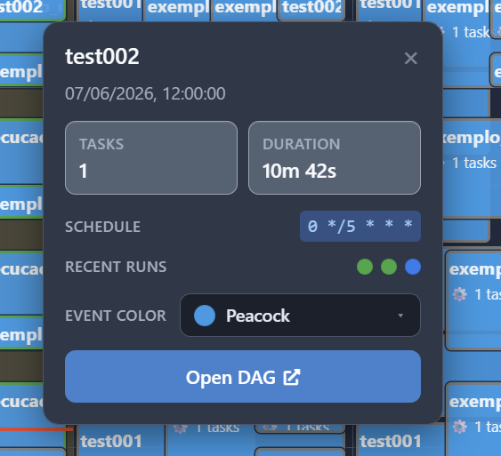
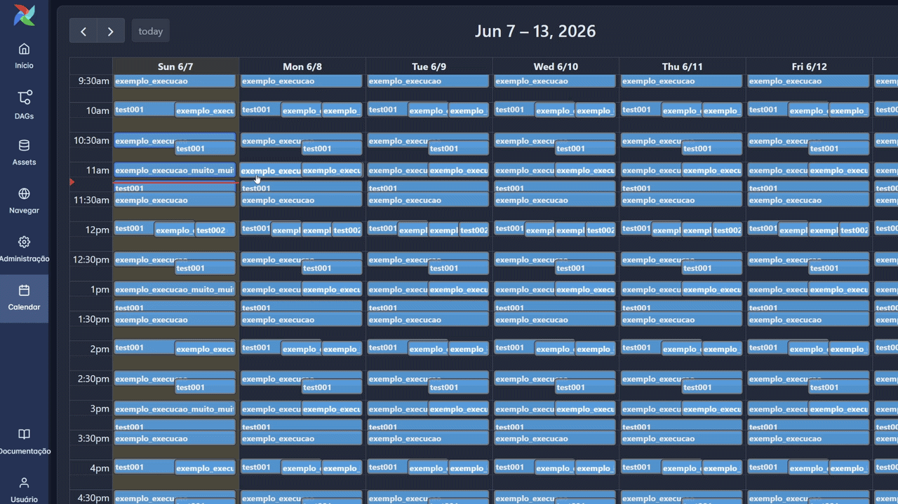
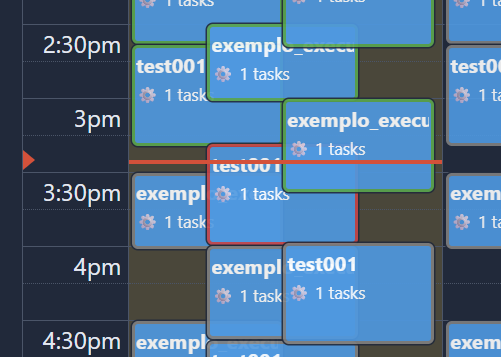
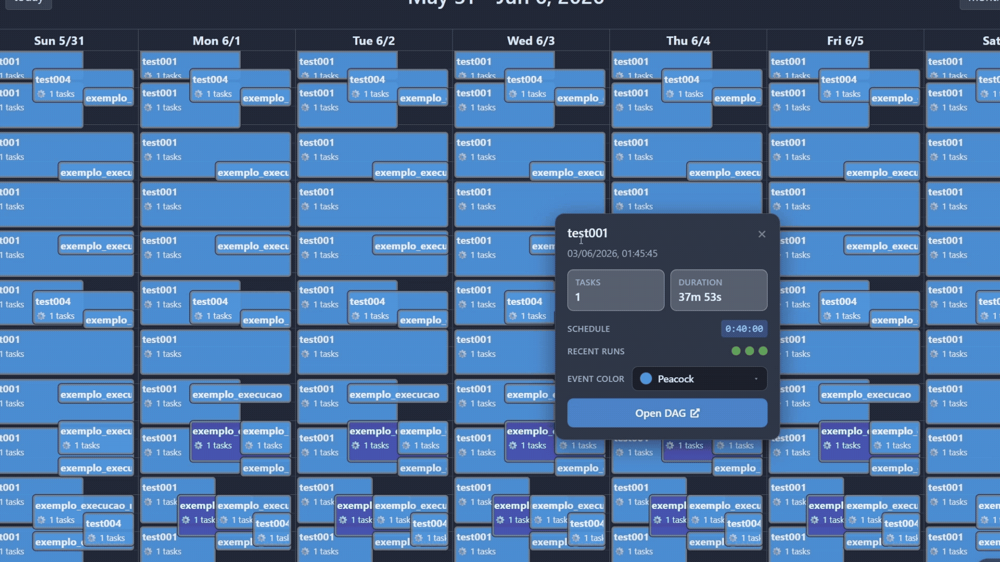

# 📅 Airflow Calendar

[](https://pypi.org/project/airflow-calendar/)
[](https://opensource.org/licenses/Apache-2.0)
[](https://pypi.org/project/airflow-calendar/)

[](https://airflow.apache.org/)
[](https://airflow.apache.org/)


A modern and intuitive calendar interface for visualizing your DAG schedules in Apache Airflow. Transform complex cron expressions into a clear and searchable time grid inspired by the Google Calendar experience.


---

# 🎯 Why Airflow Calendar?

Have you ever felt lost trying to keep track of your Airflow DAG schedules?

When managing complex environments with dozens of DAGs, each with different execution requirements, losing control of your schedule is common.

While Airflow provides features to visualize the execution history of individual DAGs, it lacks a "global" view to see all scheduled DAGs at once.

This is where Airflow Calendar comes in. It provides a visual timeline of all your DAG schedules, allowing you to see at a glance when each DAG is set to run, identify potential overlaps, avoid resource conflicts, and manage concurrency and dependencies effectively.

You can check more details about the project in the [Medium article](https://medium.com/data-engineer-things/airflow-calendar-improving-dag-management-with-a-visual-schedule-cd330df1d644).

# ✨ Key Features
Manage complex production environments is easier with Airflow Calendar. Here are some of the key features.

## Informative Metadata Modal

Clicking on any event in the calendar opens an informative pop-up card with important details about your DAG.

It allows you to have a snapshot of everything you need to know about that specific DAG without navigating away to look up more information:

- **Duration**: Shows the average execution time of the DAG based on past successful runs. This duration also defines how long the event block looks on your calendar.
- **Structural context**: View the Cron string or timedelta interval, alongside the total task count.
- **Recent run history**: A small timeline displaying the status of the last 5 executions so you can evaluate stability at a glance.



## Native UI Navigation

A major annoyance with third-party dashboards is having to manually search for a pipeline once you find an issue. The plugin solves this by embedding a **direct shortcut** inside the metadata modal.

That said, if a DAG needs further attention, just click the event and hit the "**Open DAG**" button.




## Intuitive Grid View with Live Execution Status

In addition to showing when a DAG is scheduled to run, it also overlays the **real-time execution status** right on the calendar interface.

By leveraging color-coded borders, you can instantly see the health of your past and current runs:

- **Green Borders**: Successful runs.
- **Red Borders**: Failed runs that require your attention.
- **Blue Borders**: Jobs that are in execution at the moment.
- **Gray Borders**: Future scheduled runs or jobs currently in queue.



## Custom Event Coloring

When managing complex production environments, it's common to have pipelines with different levels of criticality and use cases.

To address this, the Airflow Calendar also supports custom event coloring, allowing you to visually group certain pipelines together.




---

# 🚀 Installation

The recommended way to install **Airflow Calendar** is via pip. In the environment where Airflow is installed, run the following command:

```bash
pip install airflow-calendar
```

Otherwise, you can also clone this repository and install it manually by moving the `airflow_calendar` directory to your Airflow plugins folder.

> Note: You may need to restart your Airflow Webserver after installation for the plugin to be picked up.

## Verifying Installation on Airflow 2

If everything is set up correctly, you should see a new "Calendar" option under the "Browse" menu in the Airflow UI:


## Verifying Installation on Airflow 3

If you're using Airflow 3, you will notice a brand-new "Calendar" icon sitting in your main navigation bar. Click on it, and your visual schedule will instantly render:


### ⚙️ Configuration & Permissions
If the plugin is loaded but the Calendar option is not visible under the Browse menu, you likely need to grant permissions to your user role:

1. Navigate to **Security > List Roles**.
2. Edit your specific role (e.g., Admin, Op, or Viewer).
3. Add the permission: ```menu access on Calendar```.
4. Save and refresh the page.

### 🔍 Troubleshooting
If the "Calendar" option still doesn't show up in the menu:

- **Check Plugin Status:** Go to Admin > Plugins. You should see ```airflow_calendar``` listed there.
- **Logs:** If it's not listed, check your webserver logs.
- **CLI:** Run ```airflow plugins``` in your terminal to verify if the package was loaded correctly into the environment and check for any errors during loading.

---

## 🛠️ Roadmap
This project is a continuous work in progress. Feel free to suggest new features or report issues! 

The upcoming features include:

- [x] **Airflow 3 Compatibility:** Support for the next generation of Airflow.
- [x] **Dynamic Styling:** Background colors for events based on DAG tags.
- [ ] **Search functionality:** Quickly find specific events within the calendar.

---

## 🤝 Contributing

This project is open to contributions! Whether it's reporting a bug, suggesting a feature, or submitting a Pull Request:

1. Open an issue to discuss the change you wish to make.
2. Fork the repository and create your feature branch.
3. Commit your changes with clear descriptions.
4. Push to the branch and open a Pull Request.
